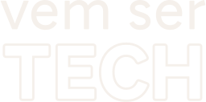

# **Vem Ser Tech - Front End**

Bem-vindo ao meu repositório do programa Vem Ser Tech - Front End, em parceria com a empresa ADA e o iFood. Este repositório foi criado para armazenar os arquivos, atividades e recursos relacionados às aulas.

## **Sobre o Programa**

 

O **Vem Ser Tech** é um programa educacional voltado para o desenvolvimento de habilidades de programação, com foco na formação de profissionais para atuar na área de tecnologia. Em parceria com a ADA e o iFood, este programa oferece oportunidades de aprendizado e crescimento para pessoas que desejam ingressar nesse campo.

O programa contava com 4 opções de trilhas de estudos: Front-End, Back-End, DevOps e Dados. A trilha que escolhi e fui selecionado foi a de **Front-End** que tem uma carga horária de **324h**.

## **Conteúdo 📃**

- [**Módulo 1 - *Front End Estático***](./modulo01-frontend-estatico/)
- [**Módulo 2 - *Lógica de Programação I (JS/TS)***](./modulo02-logica-de-programacao-i/)
- [**Módulo 3 - *Programação Orientada a Objetos I (JS/TS)***](./modulo03-poo/)
- [**Módulo 4 - *Front End Dinâmico (JS DOM)***](./modulo04-frontend-dinamico/)
- [**Módulo 5 - *Framework de Front End I (React)***](./modulo05-react-I/)
- [**Módulo 6 - *Framework de Front End II (React)***](./modulo06-react-II/)

## **Agradecimentos 🙏🏻**

Agradeço ao iFood e à ADA por tornarem este programa possível e por investirem na formação de talentos na área de tecnologia, assim como meus familiares e amigos que sempre me apoiaram. Foi uma grande conquista pessoal ter finalmente sido selecionado para este programa após três tentativas. Esta oportunidade não apenas representa um marco significativo em minha jornada, mas também é um testemunho do poder da perseverança e da determinação. O apoio e os recursos fornecidos pelo iFood e pela ADA são verdadeiramente inestimáveis, espero cosneguir aproveitar ao máximo essa experiência para aprimorar minhas habilidades e por meio disto, conquistar minha primeira vaga no mercado de trabalho na área de tecnologia.

## **Licença 📝**

Este projeto está licenciado sob a [**MIT License**](./LICENSE).
