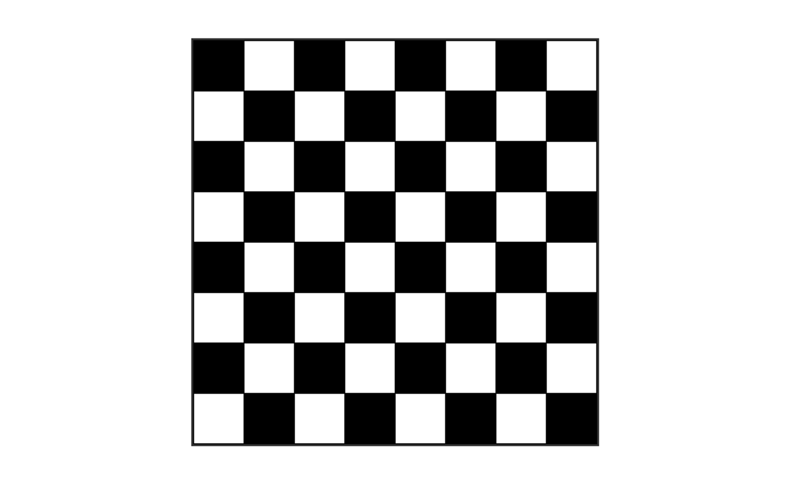
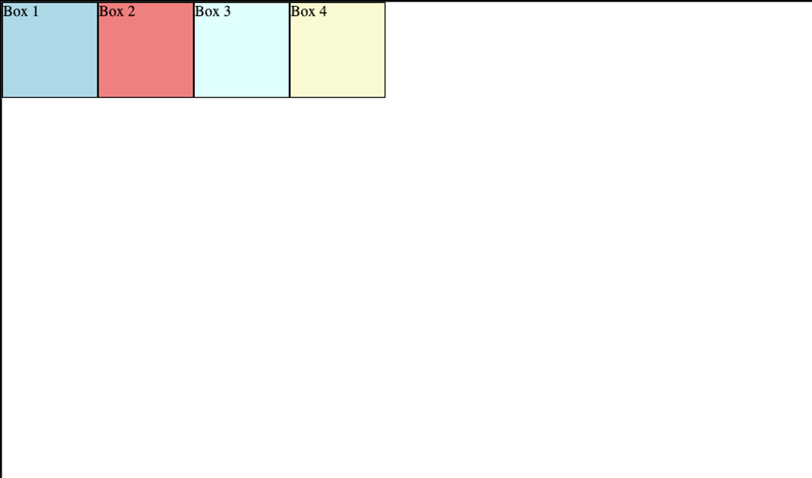
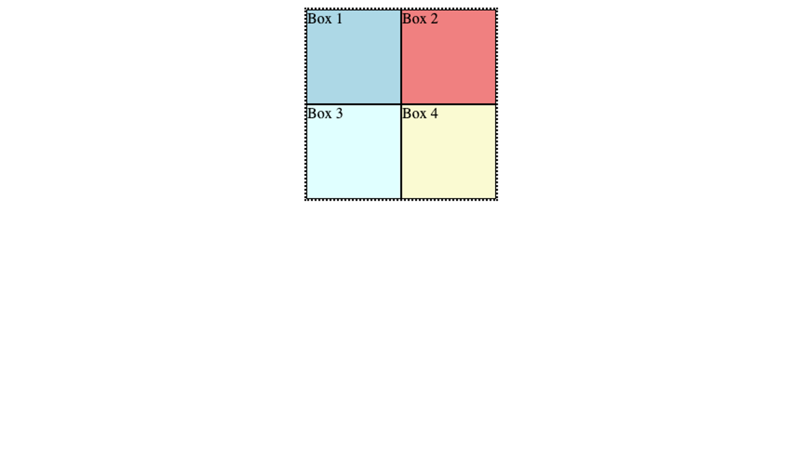

# Aula 5

## O que vamos aprender nessa aula

- Explorar medidas do CSS
- Explorar seletores do CSS
- Explorar o calc() do CSS
- Explorar os posicionamentos no CSS

### Tipos de Medidas no CSS

- **Pixels (`px`)**: Unidade de medida que representa um pixel de tela.
- **Porcentagem (`%`)**: Unidade de medida relativa ao tamanho do elemento pai.
- **Viewport Width (`vw`)**: Unidade de medida relativa à largura da janela de visualização.
- **Viewport Height (`vh`)**: Unidade de medida relativa à altura da janela de visualização.
- **Viewport Minimum (`vmin`)**: Unidade de medida relativa ao menor valor entre a largura e a altura da janela de visualização.
- `vmin` e `vmax` estão relacionados com o valor *máximo* e *mínimo* destas larguras e alturas, dependendo de qual é a menor e a maior.
- **Viewport Maximum (`vmax`)**: Unidade de medida relativa ao maior valor entre a largura e a altura da janela de visualização.
  - Por exemplo, se o navegador foi ajustado para `1100px` de largura e a altura `700px`, `1vmin` seria `7px` e `1vmax` seria `11px`.
- **Em (`em`)**: Unidade de medida relativa ao tamanho da fonte do elemento pai.
- **Rem (`rem`)**: Unidade de medida relativa ao tamanho da fonte do elemento raiz do documento.
- **Centímetros (`cm`)**: Unidade de medida relativa a centímetros.
- **Milímetros (`mm`)**: Unidade de medida relativa a milímetros.
- **Polegadas (`in`)**: Unidade de medida relativa a polegadas.
- **Pontos (`pt`)**: Unidade de medida relativa a pontos (1 ponto é igual a 1/72 de uma polegada).
- **Picas (`pc`)**: Unidade de medida relativa a picas (1 pica é igual a 12 pontos).

### Uso do `calc()` no CSS

O `calc()` é uma função do CSS que permite realizar operações matemáticas em valores. Isso é útil para definir valores de propriedades de forma dinâmica, combinando diferentes unidades de medida.

Exemplo de uso do `calc()`:

```css
width: calc(50% - 20px);

```

Nesse exemplo, a largura do elemento será calculada subtraindo 20 pixels do valor equivalente a 50% da largura do elemento pai.

O `calc()` permite a utilização de operadores matemáticos como adição (+), subtração (-), multiplicação (*) e divisão (/). Também é possível combinar diferentes unidades de medida, como pixels (px), porcentagem (%) e até mesmo outras unidades de medida como em (em) e rem (rem).

```css
font-size: calc(12px + 2em);

```

Nesse exemplo, o tamanho da fonte será calculado somando 12 pixels com o dobro do tamanho da fonte do elemento pai em unidades de em.

O uso do `calc()` no CSS proporciona uma maior flexibilidade no ajuste de valores de propriedades, permitindo a criação de layouts responsivos e dinâmicos.

### Tipos de Seletores CSS

1. **Seletor de Elemento (`element`)**
    - Seleciona todos os elementos de um tipo específico.
    - Exemplo: `p` seleciona todos os elementos `<p>`.
2. **Seletor de Classe (`.class`)**
    - Seleciona elementos que possuem a classe especificada.
    - Exemplo: `.destaque` seleciona todos os elementos com a classe "destaque".
3. **Seletor de ID (`#id`)**
    - Seleciona o elemento com o ID especificado.
    - Exemplo: `#logo` seleciona o elemento com o ID "logo".
4. **Seletor de Atributo (`[attribute]`)**
    - Seleciona elementos que possuem o atributo especificado.
    - Exemplo: `[target]` seleciona todos os elementos com o atributo "target".
5. **Seletor de Atributo com Valor (`[attribute=value]`)**
    - Seleciona elementos que possuem o atributo especificado com o valor especificado.
    - Exemplo: `[type=text]` seleciona todos os elementos com o atributo "type" e o valor "text".
6. **Seletor de Filho (`parent > child`)**
    - Seleciona elementos filhos diretos de um elemento pai especificado.
    - Exemplo: `ul > li` seleciona todos os elementos `<li>` que são filhos diretos de um elemento `<ul>`.
7. **Seletor de Descendente (`ancestor descendant`)**
    - Seleciona elementos descendentes de um elemento ancestral especificado.
    - Exemplo: `div p` seleciona todos os elementos `<p>` que são descendentes de um elemento `<div>`.
8. **Seletor de Irmão Adjacente (`element + sibling`)**
    - Seleciona o primeiro irmão adjacente de um elemento especificado.
    - Exemplo: `h2 + p` seleciona o primeiro elemento `<p>` que é irmão adjacente de um elemento `<h2>`.
9. **Seletor de Irmãos Gêmeos (`element ~ sibling`)**
    - Seleciona todos os irmãos subsequentes de um elemento especificado.
    - Exemplo: `h3 ~ p` seleciona todos os elementos `<p>` que são irmãos subsequentes de um elemento `<h3>`.

### Pseudo-classes no CSS

As pseudo-classes são seletores usados para aplicar estilos a elementos em determinados estados ou condições especiais. Elas são adicionadas aos seletores existentes, precedidas por dois pontos (:).

Aqui estão alguns exemplos de pseudo-classes comuns:

- `:hover` - Aplica estilos quando o elemento é "hovered" (quando o cursor do mouse está sobre ele).
- `:active` - Aplica estilos quando o elemento é clicado ou ativado.
- `:focus` - Aplica estilos quando o elemento está em foco (por exemplo, quando é selecionado por meio de teclado ou mouse).
- `:first-child` - Aplica estilos ao primeiro elemento filho de seu elemento pai.
- `:last-child` - Aplica estilos ao último elemento filho de seu elemento pai.
- `:nth-child(n)` - Aplica estilos ao elemento filho que está na posição n em relação a seus irmãos.
- `:nth-of-type(n)` - Aplica estilos ao elemento que é o n-ésimo do mesmo tipo dentro de seu elemento pai.
- `:not(selector)` - Aplica estilos a elementos que não correspondem ao seletor especificado.

Essas são apenas algumas das pseudo-classes disponíveis no CSS. Elas são úteis para adicionar estilos específicos a elementos com base em seu estado ou posição relativa a outros elementos.

### Tipos de Posicionamento no CSS

1. **Static**
    - O posicionamento estático é o valor padrão e não modifica a posição de um elemento em relação ao fluxo normal do documento.
2. **Relative**
    - O posicionamento relativo permite que você ajuste a posição de um elemento em relação à sua posição normal.
3. **Absolute**
    - O posicionamento absoluto posiciona um elemento em relação ao seu elemento pai mais próximo.
4. **Fixed**
    - O posicionamento fixo posiciona um elemento em relação à janela de visualização, de modo que ele permaneça fixo mesmo durante a rolagem do documento.
5. **Sticky**
    - O posicionamento sticky combina características do posicionamento relativo e fixo. Ele posiciona um elemento com base na posição do scroll, mas muda para o posicionamento fixo quando atinge uma posição específica.

## Bora praticar

### Desafio 1 - `odd` e `even`

```html
<div class="chessboard">
  <table>
    <tbody>
      <tr>
        <td></td>
        <td></td>
        <td></td>
        <td></td>
        <td></td>
        <td></td>
        <td></td>
        <td></td>
      </tr>
      <tr>
        <td></td>
        <td></td>
        <td></td>
        <td></td>
        <td></td>
        <td></td>
        <td></td>
        <td></td>
      </tr>
      <tr>
        <td></td>
        <td></td>
        <td></td>
        <td></td>
        <td></td>
        <td></td>
        <td></td>
        <td></td>
      </tr>
      <tr>
        <td></td>
        <td></td>
        <td></td>
        <td></td>
        <td></td>
        <td></td>
        <td></td>
        <td></td>
      </tr>
      <tr>
        <td></td>
        <td></td>
        <td></td>
        <td></td>
        <td></td>
        <td></td>
        <td></td>
        <td></td>
      </tr>
      <tr>
        <td></td>
        <td></td>
        <td></td>
        <td></td>
        <td></td>
        <td></td>
        <td></td>
        <td></td>
      </tr>
      <tr>
        <td></td>
        <td></td>
        <td></td>
        <td></td>
        <td></td>
        <td></td>
        <td></td>
        <td></td>
      </tr>
      <tr>
        <td></td>
        <td></td>
        <td></td>
        <td></td>
        <td></td>
        <td></td>
        <td></td>
        <td></td>
      </tr>
    </tbody>
  </table>
</div>
```

```css
body {
    display: flex;
    justify-content: center;
    align-items: center;
    height: 100vh;
    margin: 0;
}

.chessboard {
    border: 2px solid #333;
    display: inline-block;
}

table {
    border-collapse: collapse;
}

td {
    width: 50px;
    height: 50px;
    text-align: center;
    border: 1px solid #000;
}
```

Crie um tabuleiro utilizando o código acima, utilize seletores css `nth-child` com valores `odd` e `even` para obter o resultado semelhante da imagem abaixo:



### Desafio 2 - Seletores CSS

```html
<section>
  <table>
    <thead>
      <tr>
        <th colspan="4">
          1
        </th>
      </tr>
      <tr>
        <th>2</th>
        <th>3</th>
        <th colspan="2">4</th>
      </tr>
    </thead>
    <tbody>
      <tr>
        <th rowspan="2">5</th>
        <td>6</td>
        <td colspan="2">7</td>
      </tr>
      <tr>
        <th>8</th>
        <td>9</td>
        <td>10</td>
      </tr>
    </tbody>
  </table>
</section>
```

```css
table {
  border-collapse: collapse;
  width: 50%;
  margin: 0 auto;
}

tr, th, td {
  border: 1px solid #000;
  padding: 8px;
  text-align: center;
  font-weight: bold;
}
```

Dado o código acima, faça as alterações necessárias no CSS (sem utilizar classe ou id) para obter o resultado esperado como na imagem abaixo.


Cores utilizadas:

- greenyellow (5)
- violet (1)
- orangered (4, 7)
- red (2, 3, 8)
- blue (10)
- gray (6, 9)

### Desafio 3 - Position `absolute`

```html
<body>
  <div class="box1">Box 1</div>
  <div class="box2">Box 2</div>
  <div class="box3">Box 3</div>
  <div class="box4">Box 4</div>
</body>
```

```css
.box1 {
  height: 100px;
  width: 100px;
  background: lightblue;
  border: 1px solid black;
  right: 222px;
  position: absolute;
}

.box2 {
  height: 100px;
  width: 100px;
  background: lightcoral;
  border: 1px solid black;
  left: 158px;
  position: absolute;
}

.box3 {
  height: 100px;
  width: 100px;
  background: lightcyan;
  border: 1px solid black;
  right: 300px;
  bottom: 100px;
  position: absolute;
}

.box4 {
  height: 100px;
  width: 100px;
  background: lightgoldenrodyellow;
  border: 1px solid black;
  top: 355px;
  right: 0;
  position: fixed;
}
```

Dado o código acima, faça  as alterações necessárias no HTML e CSS para obter o resultado esperado como na imagem abaixo.



### Desafio 4 - Position `relative` e `absolute`

```html
<body>
  <div class="box1">Box 1</div>
  <div class="box2">Box 2</div>
  <div class="box3">Box 3</div>
  <div class="box4">Box 4</div>
  
  <div class="box-border"></div>
</body>
```

```css
.box-border {
  height: 204px;
  width: 204px;
  border: 2px dotted #000;
  margin: auto;
}

.box1 {
  height: 100px;
  width: 100px;
  background: lightblue;
  border: 1px solid black;
  right: 222px;
  position: absolute;
}

.box2 {
  height: 100px;
  width: 100px;
  background: lightcoral;
  border: 1px solid black;
  right: 158px;
  top: 256px;
  position: absolute;
}

.box3 {
  height: 100px;
  width: 100px;
  background: lightcyan;
  border: 1px solid black;
  right: 300px;
  bottom: 100px;
  position: absolute;
}

.box4 {
  height: 100px;
  width: 100px;
  background: lightgoldenrodyellow;
  border: 1px solid black;
  top: 355px;
  left: 135px;
  position: fixed;
}

```

Dado o código acima, faça  as alterações necessárias no HTML e CSS para obter o resultado esperado como na imagem abaixo.


