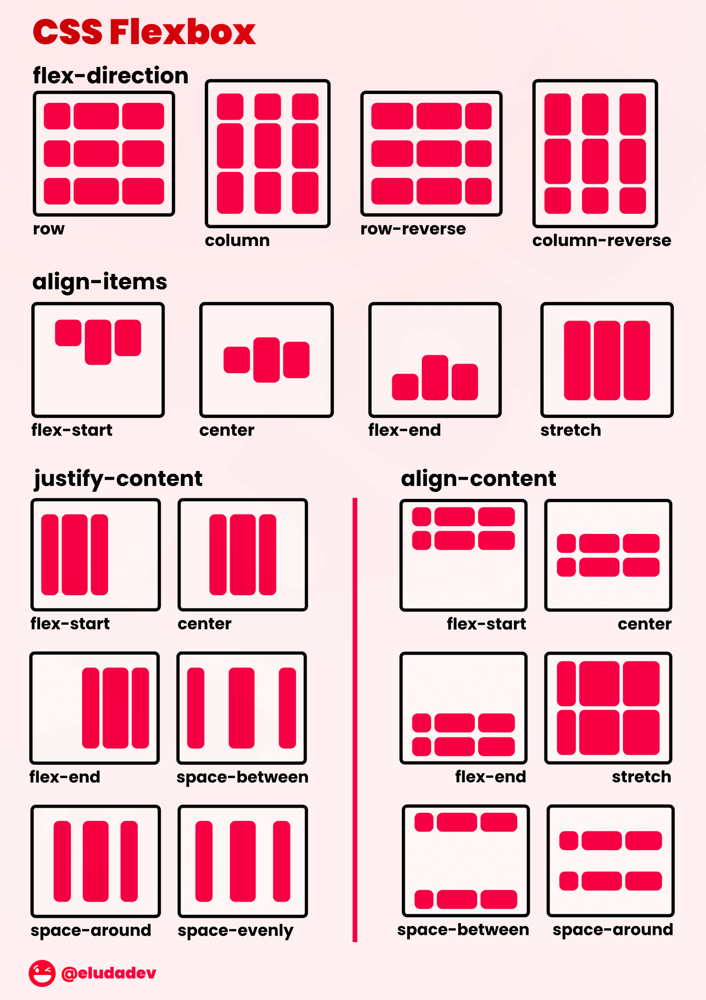

# Aula 6

## O que vamos aprender nessa aula

- Flexbox
- Template grid

## `display: flex`

### Flexbox

Flexbox é uma técnica de layout do CSS que permite criar layouts flexíveis e responsivos. Com o `display: flex`, é possível organizar os elementos filhos de um container de forma flexível ao longo de um eixo principal.

### Flex container

O Flex Container é a tag que envolve os itens flex, ao indicar display: flex, essa tag passa a ser um Flex Container.

- `**display: flex**` → Torna o elemento um flex container automaticamente transformando todos os seus filhos diretos em flex itens.
- `**flex-direction**`

    Define a direção dos flex itens. Por padrão ele é row (linha), por isso quando o display: flex; é adicionado, os elementos ficam em linha, um do lado do outro.

    A mudança de row para column geralmente acontece quando estamos definindo os estilos em media queries para o mobile. Assim você garante que o conteúdo seja apresentado em coluna única.

- `**row**`: Os itens ficam em linha
  - `**row-reverse**`: Os itens ficam em linha reversa, ou seja 3, 2, 1.
- `**column**`: ** Os itens ficam em uma única coluna, um embaixo do outro.
  - `**column-reverse**`: **Os itens ficam em uma única coluna, um embaixo do outro, porém em ordem reversa: 3, 2 e 1.
- `**flex-wrap**`

    Define se os itens devem quebrar ou não a linha. Por padrão eles não quebram linha, isso faz com que os flex itens sejam compactados além do limite do conteúdo.

    Essa é geralmente uma propriedade que é quase sempre definida como flex-wrap: wrap; Pois assim quando um dos flex itens atinge o limite do conteúdo, o último item passa para a coluna debaixo e assim por diante.

  - `nowrap`*:* Valor padrão, não permite a quebra de linha.
  - `wrap`*:* Quebra a linha assim que um dos flex itens não puder mais ser compactado.
  - `wrap-reverse`*:* Quebra a linha assim que um dos flex itens não puder mais ser compactado. A quebra é na direção contrária, ou seja para a linha acima.
- **`flex-flow`**

    O flex-flow é um atalho para as propriedades flex-direction e flex-wrap. Você não verá muito o seu uso, pois geralmente quando mudamos o flex-direction para column, mantemos o padrão do flex-wrap que é nowrap.

    E quando mudamos o flex-wrap para wrap, mantemos o padrão do flex-direction que é row.

  - `row nowrap`*:* Coloca o conteúdo em linha e não permite a quebra de linha.
  - `row wrap`*:* Coloca o conteúdo em linha e permite a quebra de linha.
  - `column nowrap`*:* Coloca o conteúdo em coluna e não permite a quebra de linha.
- **`justify-content`**

    Alinha os itens flex no container de acordo com a direção. A propriedade só funciona se os itens atuais não ocuparem todo o container. Isso significa que ao definir flex: 1; ou algo similar nos itens, a propriedade não terá mais função

    Excelente propriedade para ser usada em casos que você deseja alinhar um item na ponta esquerda e outro na direita, como em um simples header com marca e navegação.

  - `flex-start`linha os itens ao início do container.
  - `flex-end`Alinha os itens ao final do container.
  - `center`Alinha os itens ao centro do container.
  - `space-between`Cria um espaçamento igual entre os elementos. Mantendo o primeiro grudado no início e o último no final.
  - `space-around` : Cria um espaçamento entre os elementos. Os espaçamentos do meio são duas vezes maiores que o inicial e final.
- **`align-items`**

    O align-items alinha os flex itens de acordo com o eixo do container. O alinhamento é diferente para quando os itens estão em colunas ou linhas.

    Essa propriedade permite o tão sonhado alinhamento central no eixo vertical, algo que antes só era possível com diferentes hacks.

  - `stretch`: **Valor padrão, ele que faz com que os flex itens cresçam igualmente.
  - `flex-start`*:* Alinha os itens ao início.
  - `flex-end`*:* Alinha os itens ao final.
  - `center`*:* Alinha os itens ao centro.
  - `baseline`*:*Alinha os itens de acordo com a linha base da tipografia.
- **`align-content`**

    Alinha as linhas do container em relação ao eixo vertical. A propriedade só funciona se existir mais de uma linha de flex-itens. Para isso o flex-wrap precisa ser wrap.

    Além disso o efeito dela apenas será visualizado caso o container seja maior que a soma das linhas dos itens. Isso significa que se você não definir height para o container, a propriedade não influencia no layout.

  - `stretch`*:* Valor padrão, ele que faz com que os flex itens cresçam igualmente na vertical.
  - `flex-start`*:* Alinha todas as linhas de itens ao início.
  - `flex-end`*:* Alinha todas as linhas de itens ao final.
  - `center`*:* Alinha todas as linhas de itens ao centro.
  - `space-between`*:* Cria um espaçamento igual entre as linhas. Mantendo a primeira grudada no topo e a última no bottom.
  - `space-around`*:* Cria um espaçamento entre as linhas. Os espaçamentos do meio são duas vezes maiores que o top e bottom.

### Flex Item

- `order`:

    Modifica a ordem dos flex itens. Sempre do menor para o maior, assim order: 1, aparece na frente de order: 5.

  - `número`: Número para modificar a ordem padrão. Pode ser negativo.
  - `0`: 0 é o valor padrão e isso significa que a ordem dos itens será a ordem apresentada no HTML. Se você quiser colocar um item do meio da lista no início da mesma, sem modificar os demais, o ideal é utilizar um valor negativo para este item, já que todos os outros são 0.
- `flex-grow`:

    Define a habilidade de um flex item crescer. Por padrão o valor é zero, assim os flex itens ocupam um tamanho máximo relacionado o conteúdo interno deles ou ao width definido.

    Ao definir 1 para todos os Flex Itens, eles tentarão ter a mesma largura e vão ocupar 100% do container. Digo tentarão pois caso um elemento possua um conteúdo muito largo, ele irá respeitar o mesmo.

    Se você tiver uma linha com quatro itens, onde três são flex-grow: 1 e um flex-grow: 2, o flex-grow: 2 tentará ocupar 2 vezes mais espaço extra do que os outros elementos.

    OBS: justify-content não funciona em items com flex-grow definido.

  - `número` : Basta definir um número
  - `0`: Obedece o width do elemento ou o flex-basis.
- `flex-shrink`:

    Define a capacidade de redução de tamanho do item.

  - `1`: Valor padrão, permite que os itens tenham os seus tamanhos (seja esse tamanho definido a partir de width ou flex-basis) reduzidos para caber no container.
  - `0`: Não permite a diminuição dos itens, assim um item com flex-basis: 300px; nunca diminuirá menos do que 300px, mesmo que o conteúdo não ocupe todo esse espaço.
  - `número`:Um item com shrink: 3 diminuirá 3 vezes mais que um item com 1.
- `flex-basis`:

    Indica o tamanho inicial do flex item antes da distribuição do espaço restante.

    Quando definimos o flex-grow: 1; e possuímos auto no basis, o valor restante para ocupar o container é distribuído ao redor do conteúdo do flex-item.

  - `auto`Esse é o padrão, ele faz com que a largura da base seja igual a do item. Se o item não tiver tamanho especificado, o tamanho será de acordo com o conteúdo.
  - `unidade`:Pode ser em %, em, px e etc.
  - `0`:Se o grow for igual ou maior que 1, ele irá tentar manter todos os elementos com a mesma largura, independente do conteúdo (por isso 0 é o valor mais comum do flex-basis). Caso contrário o item terá a largura do seu conteúdo.
- `flex`:

    Atalho para as propriedades flex-grow, flex-shrink e flex-basis. Geralmente você verá a propriedade flex nos flex itens ao invés de cada um dos valores separados.

    Para melhor consistência entre os browsers, é recomendado utilizar a propriedade flex ao invés de cada propriedade separada.

    No exemplo é possível ver as mesmas configurações do exemplo do flex-basis porém agora utilizando apenas a propriedade flex.

  - `1`: Define flex-grow: 1; flex-shrink: 1; e flex-basis: 0; (em alguns browsers define como 0%, pois estes ignoram valores sem unidades, porém a função de 0 e 0% é a mesma.)
  - `0 1 auto`: Esse é o padrão, se você não definir nenhum valor de flex ou para as outras propriedades separadas, o normal será flex-grow: 0, flex-shrink: 1 e flex-basis: auto.
  - `2`: Define exatamente da mesma forma que o flex: 1; porém neste caso o flex-grow será de 2, o flex-shrink continuará 1 e o flex-basis 0.
  - *`3 2 300px`*:flex-grow: 3, flex-shrink: 2 e flex-basis: 300px;
- `align-self`:

    O align-self serve para definirmos o alinhamento específico de um único flex item dentro do nosso container. Caso um valor seja atribuído, ele passara por cima do que for atribuído no align-items do container.

    Vale lembrar que o alinhamento acontece tanto em linha quanto em colunas. Por exemplo o flex-start quando os itens estão em linhas, alinha o item ao topo da sua linha. Quando em colunas, alinha o item ao início (esquerda) da coluna.

  - `auto`: Valor inicial padrão. Vai respeitar o que for definido pelo align-items no flex-container.
  - `flex-start`*:* Alinha o item ao início.
  - `flex-end`*:* Alinha o item ao final.
  - `center`*:* Alinha o item ao centro.
  - `baseline`*:* Alinha o item a linha de base.
  - `stretch`*:* Estica o item.

## `display: grid`

### Grid Container

O Grid Container é a tag que envolve os itens do grid, ao indicar display: grid, essa tag passa a ser um Grid Container.

- `grid-template-columns`

    Define o número total de colunas que serão criadas no grid.

  - `100px 100px 100px 100px`:Quatro colunas de 100px de largura são criadas
  - `1fr 2fr`:Duas colunas são criadas, sendo a segunda com o dobro do tamanho da primeira. fr é uma unidade fracional. O tamanho do conteúdo é respeitado, ou seja, se o conteúdo na primeira coluna for maior que o da segunda, a primeira será maior.
  - `minmax(200px, 1fr) 1fr 1fr`:Três colunas são criadas, a primeira terá no mínimo 200px de largura e no máximo 1fr(isso significa que após 200px ela se expande da mesma forma que as outras colunas). As outras duas colunas vão ter 1fr.
  - `repeat(3, 1fr)`:Cria 3 colunas com 1fr de tamanho. O repeat seria a mesma coisa que escrever 1fr 1fr 1fr.
  - `repeat(auto-fit, minmax(100px, auto))`:Cria automaticamente um total de colunas que acomode itens com no mínimo 100px de largura.
- `grid-template-rows` :

    Define a quantidade de linhas no grid.

  - `50px 100px 50px 150px`*:* Cria 4 linhas no grid, sendo a primeira com 50px, segunda 100px, terceira 50px e quarta 150px. Caso o grid necessite de mais linhas, elas terão o tamanho de acordo com o conteúdo.
  - `1fr 2fr`:Cria 2 linhas no grid, sendo a segunda com cerca de duas vezes o tamanho da primeira.
- `grid-template-areas`

    Define áreas específicas no grid. O ponto (.) pode ser utilizado para criar áreas vazias.

    *`"logo nav nav"`*

    *`"sidenav content advert"`*

    *`"sidenav footer footer"`*: Cria 3 colunas e 3 linhas. [logo] ocupa a coluna 1, linha 1. [nav] ocupa da coluna 2 a 3, linha 1. [sidenav] ocupa a coluna 1, da linha 2 a 3. [content] ocupa a coluna 2, linha 2. [advert] ocupa a coluna 3, linha 2. [footer] ocupa da coluna 2 a 3, linha 3

- `grid-template`

    Atalho para definir o grid-template-columns, grid-template-rows e grid-template-areas.

    *`"logo nav nav" 50px`*

    *`"sidenav content advert" 150px`*

    *`"sidenav footer footer"`*

    *`100px/ 100px 1fr 50px`* A primeira linha com 50px, segunda com 150px e terceira com 100px. A primeira coluna com 100px, a segunda 1fr e a terceira com 50px.

- `gap`

    Define o gap (gutter) entre os elementos do grid.

  - `gap: 20px`: Define 20px entre os elementos do grid (linha e coluna).
  - `column-gap: 20px`: Define 20px de distância entre as colunas.
  - `row-gap: 20px`: Define 20px de distância entre as linhas.
- `grid-auto-columns`

    Define o tamanho das colunas do grid implícito (gerado automaticamente, quando algum elemento é posicionado em uma coluna que não foi definida).

  - `100px`: As colunas implícitas, geradas automaticamente, terão 100px de largura.
- `grid-auto-rows`

    Define o tamanho das linhas do grid implícito (gerado automaticamente, quando algum elemento é posicionado em uma linha que não foi definida).

  - `100px` : As linhas implícitas, geradas automaticamente, terão 100px de altura.
- `grid-auto-flow`

    Define o fluxo dos itens no grid. Se eles vão automaticamente gerar novas linhas ou colunas.

  - `row`: Automaticamente gera novas linhas.
  - `column`: Automaticamente gera novas colunas.
  - `dense`: Tenta posicionar o máximo dos elementos que existirem nas primeiras partes do grid (pode desorganizar o conteúdo).
- `grid`

    Atalho geral para definir o grid: grid-template-rows, grid-template-columns, grid-template-areas, grid-auto-rows, grid-auto-columns e grid-auto-flow

  - `100px / 1fr 1fr`: Gera uma linha com 100px de altura e 2 colunas com 1fr.
  - `100px / auto-flow 100px 50px`: Gera uma linha com 100px de altura. O grid-auto-flow é definido como column (pois está logo antes da definição das colunas). Ele também define o grid-auto-columns com 100px 50px
- `justify-content`

    Justifica os itens do grid em relação ao eixo x (horizontal).

  - `start`*:* Justifica os itens ao início.
  - `end`*:* Justifica os itens ao final.
  - `stretch`*:* Estica os itens.
  - `space-around`*:* Distribui espaço entre os elementos. (O início e final são menores que os espaços internos).
  - `space-between`*:* Cria um espaço entre os elementos, ignorando o início e final.
  - `space-evenly`*:* Cria um espaço igual entre as colunas (no início e final também).
  - `center`*:* Centraliza o conteúdo.
- `align-content`

    Alinha os itens do grid em relação ao eixo y (vertical).

  - `start`*:* Alinha os itens ao início.
  - `end`*:* Alinha os itens ao final.
  - `stretch`*:* Estica os itens.
  - `space-around`*:* Distribui espaço entre os elementos. (O início e final são menores que os espaços internos).
  - `space-between`*:* Cria um espaço entre os elementos, ignorando o início e final.
  - *`aspace-evenly`:* Cria um espaço igual entre as colunas (no início e final também).
  - `center`*:* Centraliza o conteúdo.
- `justify-items`

    Justifica o conteúdo dos itens do grid em relação ao eixo x (horizontal). Justifica em relação a célula.

  - `start`: Justifica os itens ao início.
  - `end`:Justifica os itens ao final.
  - `center`: Centraliza o conteúdo.
  - `stretch`: Estica os itens.
- `align-items`

    Alinha o conteúdo dos itens do grid em relação ao eixo y (vertical). Alinha em relação a célula.

  - `start`: Alinha os itens ao início.
  - `end`: Alinha os itens ao final.
  - `center`: Centraliza o conteúdo.
  - `stretch`: Estica os itens.

### Grid Item

- `grid-column`

    Define quais colunas serão ocupadas pelo grid item. É possível definir uma linha de início e final, assim o item irá ocupar múltiplas colunas.

  - `1` O item ocupará a coluna 1.
  - `1 / 3` O item ocupará a coluna 1 e 2 (Sim, isso mesmo, 1 e 2, pois os valores 1 / 3 são referentes as linhas da coluna. Isso significa que começa na linha 1 (início do grid) e vai até a linha 3, que é o começo da terceira coluna).
  - `2` O item vai começar na linha 2.
  - `4` O item vai terminar na linha 4.
  - `2` O item irá ocupar duas colunas a partir de onde ele estiver.
- `grid-row`

    Define quais linhas serão ocupadas pelo grid item.

    Atenção aqui, pois esse linha é referente a row. Porém as chamadas grid lines que por tradução também significam linhas do grid, são diferentes. Uma row (linha), possui sempre 2 grid lines (linhas do grid), uma no início dela e uma no final dela.

  - `grid-row: 1`: O item ocupará a linha 1.
  - `grid-row: 1 / 3`: O item ocupará a linha 1 e 2 (Sim, isso mesmo, 1 e 2, pois os valores 1 / 3 são referentes as linhas do grid. Isso significa que começa na linha 1 (início do grid) e vai até a linha 3 do grid, que é o começo da terceira linha).
  - `grid-row-start: 2`: O item vai começar na linha do grid 2.
  - `grid-row-end: 4`: O item vai terminar na linha do grid 4.
  - `grid-row: span 2`: O item irá ocupar duas linhas a partir de onde ele estiver.
- `grid-area`

    Define a área do item do grid. É um atalho para grid-row-start, grid-column-start, grid-row-end, grid-column-end.

    O z-index pode ser utilizado para manipular a posição no eixo Z do item. Ou seja, se um item for posicionado em cima de outro, o z-index controla qual vêm na frente.

  - `1 / 2 / 4 / 3`: Este é um atalho para: `grid-row-start: 1;grid-column-start: 2;grid-row-end: 4;grid-column-end: 3;`
  - `header` : Vai posicionar o item na área definida como header.
- `justify-self`

    Justifica o item do grid em relação ao eixo x (horizontal). Justifica em relação a célula.

  - `start`: Justifica o item ao início.
  - `end`: Justifica o item ao final.
  - `center`: Centraliza o conteúdo.
  - `stretch`: Estica o item.
- `align-self`

    Justifica o item do grid em relação ao eixo y (vertical). Alinha em relação a célula.

  - `start`: Alinha o item ao início.
  - `end`: Alinha o item ao final.
  - `center`: Centraliza o conteúdo.
  - `stretch`: Estica o item.
